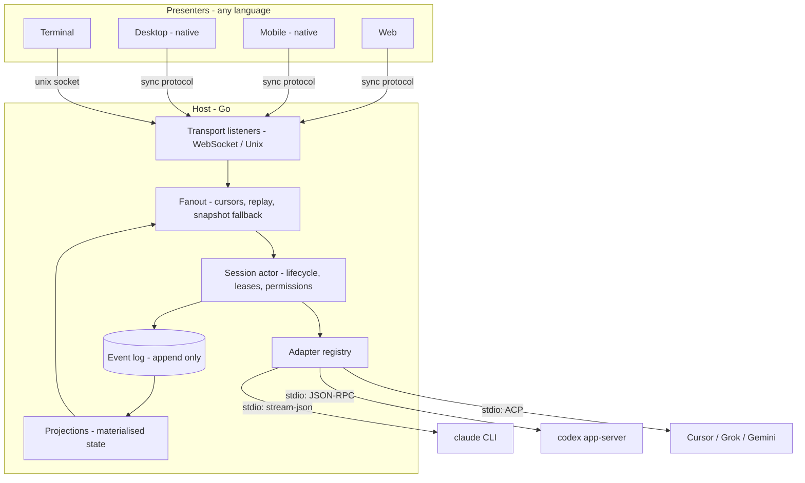

# Harness Multiplexer Architecture

A Go server that drives multiple coding harnesses (Claude Code, Codex, Cursor, Grok) behind one canonical protocol, so that any number of UIs — web, mobile, desktop, terminal — can attach to the same live session from anywhere.

---

## 1. Goals and non-goals

**Goals**

- One canonical event vocabulary, aligned with ACP where practical, that every harness normalises into.
- Any UI can attach to any session at any time and reconstruct exact state.
- A session survives every client disconnecting. Compute lives on the server.
- Adding a UI requires no server changes. Adding a harness requires one adapter and nothing else.
- Correctness under adversarial network conditions: duplicate delivery, reordering, mid-turn disconnect, simultaneous attach from two devices, a slow mobile client.

**Non-goals**

- Running the agent in the browser. The server owns the filesystem and the process tree.
- Surviving server death mid-turn. A killed harness loses its turn; the log preserves everything up to the last committed event.
- Multi-tenant isolation. Single-user, single-trust-domain.

**Language: Go**, for the server only. The protocol is the boundary, so the server's language has no bearing on the UIs — see §8 (concurrency) and §9 (adapters), where Go materially helps.

---

## 2. The role split

This is the central design decision and everything else follows from it.

ACP defines two roles: an **agent** (subprocess) and a **client** (editor). The client answers `fs/read_text_file`, `terminal/create`, and `session/request_permission`, because in ACP's origin story the client is an editor on the same machine as the code.

Here the client role splits across a network boundary:

| ACP client responsibility | Who services it | Why |
|---|---|---|
| `fs/read_text_file`, `fs/write_text_file` | **Host** (Go server) | The filesystem is on the server. |
| `terminal/*` | **Host** | The process tree is on the server. |
| `session/request_permission` | **Presenter** (UI) | Needs a human. |
| `session/elicitation` | **Presenter** (UI) | Needs a human. |
| `session/update` (streaming) | **Host** records, Presenter renders | Durability first, display second. |

The Host is a full ACP client. The Presenter is not an ACP participant at all — it speaks the sync protocol (§6) and never sees JSON-RPC.

The consequence worth stating explicitly: **a permission request is not an RPC to a connection. It is a durable part of session state.** If the phone that triggered a tool call goes into a tunnel, the laptop must be able to answer the prompt. This falls out for free once permission requests are events in the log rather than promises held in a socket handler.

---

## 3. Layers



Strict dependency direction: transports depend on fanout, fanout on projections, projections on the log, adapters on nothing but the canonical event types. **No layer may reach back up.** An adapter that knows a connection exists is a bug.

Note what Go buys you here: *every* harness is a subprocess speaking line-delimited JSON over stdio. There is no in-process special case. In TypeScript, Claude would be the odd one out (in-process SDK) and the other two subprocesses; in Go all three are uniform.

---

## 4. Canonical event model

The vocabulary maps directly to ACP's `session/update` variants and RPC surface, keeping the ACP adapter close to an identity function.

**Lifecycle**
```
session.created        { sessionId, cwd, harness, model, mode }
session.config_changed { model?, mode?, configOption? }
turn.started           { turnId, prompt }
turn.finished          { turnId, stopReason }
session.closed         { reason }
```
`stopReason` ∈ `end_turn | max_tokens | max_turn_requests | refusal | cancelled | error`

**Content**
```
message.chunk       { turnId, role: user|agent, kind: text|thought, contentIndex, delta }
tool_call.started   { toolCallId, kind, title, status }
tool_call.updated   { toolCallId, status, content?, locations? }
plan.updated        { entries }
usage.updated       { input, output, cacheRead, cacheWrite, cost }
commands.updated    { commands }
```
`tool_call.kind` ∈ `read | edit | delete | move | search | execute | think | fetch | switch_mode | other`
`tool_call.status` ∈ `pending | in_progress | completed | failed`

**Human interaction** (durable, not transient)
```
permission.requested  { requestId, toolCallId, options }
permission.resolved   { requestId, outcome, optionId? }
elicitation.requested { requestId, prompt, schema }
elicitation.resolved  { requestId, value }
```
`outcome` ∈ `allow_once | allow_always | reject_once | reject_always | selected | cancelled`

Every event carries `{ sessionId, seq, timestamp }`. `seq` is a per-session monotonic integer assigned at append. There is no global sequence — sessions are independent streams, which keeps append contention per-session and makes sharding trivial later.

Generate the Go types from ACP's published JSON schema rather than hand-writing them. Hand-maintained enums drift.

---

## 5. Durability

The event log is the single source of truth. Projections are derived and may be rebuilt at any time.

Use **`modernc.org/sqlite`** (pure Go, no cgo) unless you have measured a reason not to — it keeps cross-compilation for the terminal client and any future ARM deployment painless. WAL mode, one writer connection, a pool of readers.

```sql
CREATE TABLE sessions (
  id            TEXT PRIMARY KEY,
  cwd           TEXT NOT NULL,
  harness       TEXT NOT NULL,
  created_at    INTEGER NOT NULL,
  updated_at    INTEGER NOT NULL,
  head_seq      INTEGER NOT NULL DEFAULT 0,
  phase         TEXT NOT NULL          -- idle | turn | closing
);

CREATE TABLE events (
  session_id    TEXT NOT NULL,
  seq           INTEGER NOT NULL,
  type          TEXT NOT NULL,
  payload       BLOB NOT NULL,         -- JSON
  created_at    INTEGER NOT NULL,
  PRIMARY KEY (session_id, seq)
);

-- Periodic materialisation so attach does not replay from zero.
CREATE TABLE snapshots (
  session_id    TEXT NOT NULL,
  seq           INTEGER NOT NULL,
  state         BLOB NOT NULL,
  PRIMARY KEY (session_id, seq)
);

-- Single-writer enforcement across processes.
CREATE TABLE leases (
  session_id    TEXT PRIMARY KEY,
  owner_id      TEXT NOT NULL,
  fence         INTEGER NOT NULL,
  expires_at    INTEGER NOT NULL
);

-- Command dedupe for at-least-once client delivery.
CREATE TABLE commands (
  command_id    TEXT PRIMARY KEY,
  session_id    TEXT NOT NULL,
  result        BLOB,
  created_at    INTEGER NOT NULL
);
```

Append and the `head_seq` bump happen in one transaction. Snapshots are written every N events (start at 200) and on turn boundaries; they are a cache, and deleting the table must change nothing but latency.

**Lease acquisition** uses fencing tokens:

```sql
INSERT INTO leases (session_id, owner_id, fence, expires_at)
VALUES (?, ?, 1, ?)
ON CONFLICT(session_id) DO UPDATE SET
  owner_id   = excluded.owner_id,
  fence      = leases.fence + 1,
  expires_at = excluded.expires_at
WHERE leases.expires_at <= ?
RETURNING owner_id, fence, expires_at;
```

A writer holding fence *f* aborts if it observes a lease with fence > *f*. This matters the moment a reaper, a CLI, and the server all touch one database.

---

## 6. Sync protocol

Transport-agnostic; JSON over WebSocket to start.

```
→ hello    { protocolVersion, clientId }
← welcome  { serverId, sessions: []SessionMeta }

→ attach   { sessionId, afterSeq? }
← snapshot { sessionId, seq, state }        // when afterSeq absent or gap too large
← event    { sessionId, seq, event }        // live and replayed, same shape
← synchronized { sessionId, seq }           // caught up marker
← resync   { sessionId }                    // server dropped your queue; reattach

→ command  { commandId, sessionId, ... }
← ack      { commandId, result | error }
```

**Attach algorithm.** Order is load-bearing:

1. Subscribe to the live stream **first**, buffering into the connection's queue.
2. Compute `gap = head_seq - afterSeq`.
3. If `afterSeq` is absent, `gap < 0`, or `gap > MaxReplayGap` (1000) → read the latest snapshot, fold forward to head, send `snapshot`.
4. Otherwise read events `(afterSeq, head]` from the log and send them.
5. Send `synchronized`, then drain the buffered queue.

Subscribing before reading closes the window where an event lands between the read and the subscription. The gap bound is not an optimisation — unbounded replay from a months-old cursor reads an entire session into memory, and that has OOM-killed real servers.

**Command idempotency.** Clients generate `commandId` (UUIDv7) and retry the same id on reconnect. The server checks the `commands` table and replays the stored result rather than re-executing. Without this, "I hit send, then my train went into a tunnel — did the prompt land?" has no answer, and the user double-sends.

**Backpressure.** Each connection has a bounded outbound queue (start at 256 events). On overflow the server does **not** grow the buffer and does **not** block the session actor. It drops the queue, sends `resync`, and the client reattaches with its last applied `afterSeq` — which lands in the snapshot path if it has fallen far enough behind. A phone on a bad connection must never be able to inflate server memory or stall a turn.

---

## 7. Correctness invariants

Testable, each mapped to a real failure.

1. **Total order per session.** `seq` is gapless and strictly increasing. Two events never share a seq.
2. **Log is authoritative.** Dropping all projections and snapshots and rebuilding yields identical state.
3. **Single writer.** At most one process holds a session's lease; fenced-out writers abort before appending.
4. **At-least-once, idempotent apply.** Applying an event twice is a no-op; clients discard `seq <= lastApplied`.
5. **Command idempotency.** The same `commandId` executes at most once.
6. **Attach completeness.** After `synchronized`, client state equals server state as of that seq — no event skipped or duplicated across the snapshot/replay/live seam. One carve-out: a snapshot's timeline items are windowed to the newest page for the wire, with `itemsBefore` counting what was trimmed; the trimmed items are display history, reachable via `GET /api/sessions/{id}/items`, and every other field is complete as of that seq.
7. **Nothing lives in a connection.** Every piece of state a UI needs is reconstructible from the log, pending permissions and elicitations included.
8. **Disconnect is not cancel.** Losing every client does not interrupt a turn. Only an explicit cancel does.
9. **Permission fungibility.** Any attached presenter may resolve any pending request. First resolution wins; losers get an `already_resolved` ack, not an error.
10. **Adapter purity.** Adapters emit canonical events and answer host callbacks. They never touch the log, the fanout, or a connection.
11. **Bounded replay.** No attach reads more than `MaxReplayGap` events.
12. **Bounded memory per connection.** A slow consumer is dropped and resynced, never buffered without limit.

Invariants 6, 9, and 12 are the ones "obvious" implementations quietly violate. Write those tests first.

---

## 8. Concurrency model

Go's contribution to correctness here is real, provided you commit to one discipline: **one goroutine owns each session.**

```go
type sessionActor struct {
    id       string
    inbox    chan sessionCmd    // prompts, cancels, permission resolutions
    fromHarness <-chan CanonicalEvent
    subs     map[string]*subscriber
    headSeq  int64
}
```

- All session mutation happens in that goroutine's select loop. This gives invariant 3 in-process for free — no mutex around `head_seq`, no interleaved appends — and the database lease covers the cross-process case.
- Fanout is a map of subscribers, each with a bounded buffered channel. A non-blocking send on a full channel triggers the §6 drop-and-resync. **The session actor never blocks on a slow connection.**
- `context.Context` propagates shutdown, never business-level cancel. Cancelling a turn is a `sessionCmd` on the inbox, not a context cancellation — conflating them is how you get invariant 8 wrong the first time.
- Every goroutine has an owner responsible for its termination, and every spawn site has a matching shutdown path. Adapter subprocess readers are the usual leak: a harness that exits without closing stdout will hang a naive `bufio.Scanner` loop forever, so reads carry a deadline and the process gets `Wait`ed.

Run the whole suite under `-race` in CI from milestone 1. Retrofitting race-freedom is far worse than maintaining it.

---

## 9. Adapter contract

```go
type Adapter interface {
    ID() string                                    // "claude" | "codex" | "cursor"
    CreateSession(ctx context.Context, o CreateOptions) (Session, error)
    ResumeSession(ctx context.Context, id string, o ResumeOptions) (Session, error)
    ListModels(ctx context.Context) ([]ModelMeta, error)
}

type Session interface {
    Prompt(ctx context.Context, in PromptInput) error
    Cancel(ctx context.Context) error
    SetModel(ctx context.Context, m ModelRef) error
    SetMode(ctx context.Context, mode string) error
    Events() <-chan CanonicalEvent                 // adapter → host, closed on dispose
    Close() error
}

// Host → adapter: capabilities the adapter must not implement itself.
type HostServices interface {
    ReadTextFile(ctx context.Context, path string) (string, error)
    WriteTextFile(ctx context.Context, path, content string) error
    CreateTerminal(ctx context.Context, spec TerminalSpec) (Terminal, error)
    RequestPermission(ctx context.Context, req PermissionRequest) (PermissionOutcome, error)
    Elicit(ctx context.Context, req ElicitationRequest) (json.RawMessage, error)
}
```

`RequestPermission` blocks until a `permission.resolved` event is appended — from *any* presenter, or immediately from a stored `allow_always` rule. That single indirection is what makes invariant 9 hold.

### Claude adapter

The TypeScript Agent SDK spawns the user-installed `claude` binary through `pathToClaudeCodeExecutable`. The Go adapter can communicate with that subprocess through its supported stream-JSON interface.

```
claude -p \
  --input-format stream-json \
  --output-format stream-json \
  --include-partial-messages \
  --replay-user-messages \
  --permission-mode default \
  --session-id <uuid>
```

(`default` is the SDK/config spelling of manual mode; `manual` is a CLI-only alias, and Omniplex drives the SDK.)

Verified against CLI 2.1.234: all of these flags exist, `--session-id` takes a caller-supplied UUID (so *you* own session identity, not the CLI), `--resume`/`--fork-session` cover resume and branching, and the binary implements a bidirectional `control_request` / `control_response` protocol carrying `can_use_tool`. That last one is the critical finding — it is `canUseTool` across a process boundary, so permission interception does not require the TS SDK.

Mapping work: `assistant`/`stream_event` messages → `message.chunk` and `tool_call.*`; `control_request{can_use_tool}` → `permission.requested`, answered with `control_response`. Budget this as the largest single piece of the project. Subagents (`parent_tool_use_id`) and compaction have no clean ACP representation — see the open question below.

### Codex adapter

Spawns `codex app-server`, JSON-RPC over stdio. Mechanically the same shape as the ACP adapter with a different method vocabulary.

### ACP adapter

Spawns the agent, wires JSON-RPC both ways, near-identity mapping. Covers Cursor, Grok, Gemini CLI, and anything else adopting ACP. This is the payoff for choosing ACP's vocabulary — one adapter, several vendors.

A shared `internal/jsonrpc` package (stdio framing, request/response correlation, bidirectional dispatch) serves all three, since all three are line-delimited JSON over a subprocess.

---

## 10. Transport contract

```go
type Listener interface {
    Addr() string
    Start(ctx context.Context, accept func(Conn) Handler) error
    Close() error
}

type Conn interface {
    Send(ctx context.Context, b []byte) error
    Close(final []byte) error
    Closed() bool
}
```

The server takes `[]Listener`, so WebSocket (remote UIs) and Unix socket (local terminal UI, zero-auth, zero-latency) run simultaneously against one session set. Framing and codec sit above the transport and are written once. Use `nhooyr.io/websocket` (now `coder/websocket`) over `gorilla` — context-aware API, better shutdown semantics.

---

## 11. Networking and discovery

Requirement: **no centralised hosting.** You run the binary; nothing of yours runs on someone else's infrastructure. Yet connecting from a phone on cellular must still feel like opening an app.

The server does not have one address. It enumerates every way it is currently reachable and advertises them; clients choose. Endpoint records carry reachability and per-client compatibility, because what a native app can use and what a browser can use differ:

```go
type Endpoint struct {
    ID           string
    Label        string
    Provider     string  // unix | lan | overlay | tunnel | manual
    HTTPBaseURL  string
    WSBaseURL    string
    Reachability string  // loopback | lan | overlay | public
    Compatibility struct {
        Browser string  // ok | mixed-content-blocked | cert-untrusted
        Native  string  // ok | unknown
    }
    Status string        // available | degraded | unavailable
}
```

### The tiers

**Tier 0 — same machine: Unix socket.** The terminal UI's default. No ports, no TLS, no auth surface; filesystem permissions are the auth. Fastest path, and the one that always works.

**Tier 1 — LAN.** The server binds `0.0.0.0` and advertises over mDNS (`_yourapp._tcp.local`). Clients on the same network discover it with no configuration — nobody types an IP address. Native clients connect over plain `ws://` happily.

**Tier 2 — overlay network: Tailscale.** The recommended remote path, and the one that satisfies "no centralised hosting" properly. WireGuard peer-to-peer between *your* devices on *your* tailnet. The server detects Tailscale and shells out to:

```
tailscale serve --bg --https=443 http://127.0.0.1:<port>
```

which yields a real, publicly-trusted TLS certificate on `<machine>.<tailnet>.ts.net`. That single fact resolves the browser problem below. Traffic goes device-to-device, falling back to Tailscale's DERP relays only when NAT traversal fails — and end-to-end encrypted even then. Tailscale is user-installed and user-owned; the server only detects and drives it.

**Tier 3 — tunnel: opt-in, and the one honest exception.** A `cloudflared` quick tunnel gives a public HTTPS URL with zero network setup, useful for handing a link to someone else. It routes through Cloudflare. Ship it, default it off, and label it in the UI as the option that is not self-hosted, so the choice is informed.

### The browser problem, and why the binary serves the web UI

A web app loaded from an `https://` origin cannot open `ws://192.168.1.20:8080` — browsers block it as mixed content. This is not a corner case; it is the default outcome of hosting a web UI anywhere and pointing it at a LAN server. Endpoint compatibility therefore records `mixed-content-blocked` for browser clients whenever an `http:` endpoint would cause this mismatch.

Two clean resolutions, and the design uses both:

1. **Embed the web UI in the Go binary** (`go:embed`) and serve it from the same origin as the API. An `http://` page talking to `ws://` on its own origin has no mixed-content problem, no CORS, and — decisively — **no hosting at all**. This is what makes tier 1 work in a browser.
2. **Tailscale Serve for remote**, which provides a genuine certificate, so an `https://` page talking `wss://` to its own origin works from anywhere.

Native clients are exempt from all of this and may use any tier, including pinned self-signed certificates on the LAN.

### Pairing and authentication

With no central identity service, trust is established once, per device:

- The server displays a pairing code and QR encoding `{endpoints, pairingToken}`.
- The device redeems it for a long-lived, per-device token, stored server-side and individually revocable.
- Every tier requires the token, including over Tailscale. Tailnet identity is good, but the auth model stays uniform across tiers rather than varying by how you happened to connect.

### Why roaming is seamless

The client holds the endpoint list from `welcome` and tries them in preference order: unix → lan → overlay → tunnel. When the current endpoint stops responding, it moves to the next.

Endpoint migration costs nothing extra because of §6: reconnecting to a *different address* is the same operation as reconnecting to the same one — attach with `afterSeq`, receive the gap. Walk out of the house mid-turn and the phone drops the LAN endpoint, reattaches over Tailscale, and replays what it missed. The user sees a brief spinner.

Seamless roaming is therefore not a feature to be built. It falls out of cursor-based resume, provided no state ever lives in a connection (invariant 7).

---

## 12. Client implementations

**Pick the right language per platform.** Native for mobile and desktop, Go for the terminal, TypeScript for web — or otherwise entirely; the architecture takes no position and the server's language constrains nothing. The server exposes a socket speaking the §6 protocol, and anything that can open one is a first-class client.

The consequence is that there will be **several client implementations**, and each must independently get the hard part right:

- Connection supervision: backoff ladder (3s, 4s, 8s, 16s), reset after 30s stable, immediate retry on network-regained and app-foreground.
- Endpoint selection and failover (§11).
- Cursor tracking; reattach with `afterSeq`; handle `resync`.
- Fold events into state; discard `seq <= lastApplied`.
- Persist `lastApplied` and outbound `commandId`s so a killed app resumes rather than restarts.

Two things make that safe rather than a source of four divergent bugs:

**The protocol is the contract.** Define it in one versioned schema. Generate the server's Go types and every client's types from it. No language owns the definition.

**A conformance suite is mandatory, not optional.** A corpus of recorded server↔client transcripts — mid-attach event arrival, forced `resync`, duplicate delivery, reconnect with a stale cursor, endpoint failover mid-turn — plus a driver that replays them against any implementation and asserts final state. Every client passes before it ships.

This is the piece most projects skip and later regret, because the reconnect paths are precisely the ones that are miserable to test by hand and that fail only on someone's train.

Given that, a UI is a thin renderer over `SessionState` plus whatever is idiomatic for the platform.

---

## 13. Failure modes

| Failure | Behaviour |
|---|---|
| Presenter disconnects mid-turn | Turn continues. Events accumulate. Reattach replays. |
| Presenter reattaches after 10k events | Gap exceeds bound → snapshot + fold forward. |
| Presenter too slow to drain | Queue dropped, `resync` sent, client reattaches. Server memory flat. |
| Two presenters answer one permission | First wins; second gets `already_resolved`. |
| Prompt sent, connection dies before ack | Retry with same `commandId`; stored result returned. |
| Harness subprocess crashes | `turn.finished{stopReason:"error"}` appended; session returns to idle; transcript intact. |
| Harness exits without closing stdout | Read deadline fires; process reaped; session errored, not hung. |
| Server restarts mid-turn | Interrupted turn closed with `stopReason:"error"`; log intact to last committed event. The session is resumed at startup without waiting for a presenter, and a recovery turn asks the agent to check the real state and continue. Capped at three consecutive recoveries. |
| Second process opens same session | Lease fencing; loser aborts before appending. |
| Snapshot table deleted | Attach latency rises. Nothing else changes. |

---

## 14. Build order

Each milestone is independently verifiable. Resist reordering — the invariants are cheapest to establish before three adapters depend on them.

1. **Log + projections.** Append, fold, rebuild. Invariants 1, 2, 4.
2. **Session actor + fanout + sync protocol** over WebSocket, driven by a fake adapter emitting scripted events. Invariants 6, 11, 12 — including the adversarial "event lands during attach" case and a deliberately stalled consumer. Under `-race`.
3. **First client + conformance suite.** Supervisor, cursor, endpoint failover, store — in whichever language you want the first UI in. Build the transcript corpus here, while there is only one implementation to satisfy.
4. **Claude adapter.** First real harness. Expect the canonical model to need revision here — that is why it lands after the seam is tested and before a second adapter depends on it.
5. **One UI**, web, thin.
6. **ACP adapter.** Should light up Cursor and Grok nearly free.
7. **Leases, terminal service, `allow_always` rules.**
8. **Second UI, different language** — the real proof the seam holds, and the conformance suite's first outside consumer.
9. **Codex adapter.**

Milestones 1–3 are roughly 2–3k lines of Go and contain all the correctness. Milestone 4 is the largest single body of work in the project.

---

## Open question to settle before milestone 4

Whether ACP's `session/update` vocabulary cleanly absorbs everything Claude's stream emits. Subagents (`parent_tool_use_id`) and context compaction have no obvious ACP representation, and forcing them into `tool_call` may be lossy.

Cheap spike: capture one real Claude session as stream-json, map it to canonical events by hand, and list what does not fit. Do this before committing the schema — a change here after two adapters exist is expensive.
